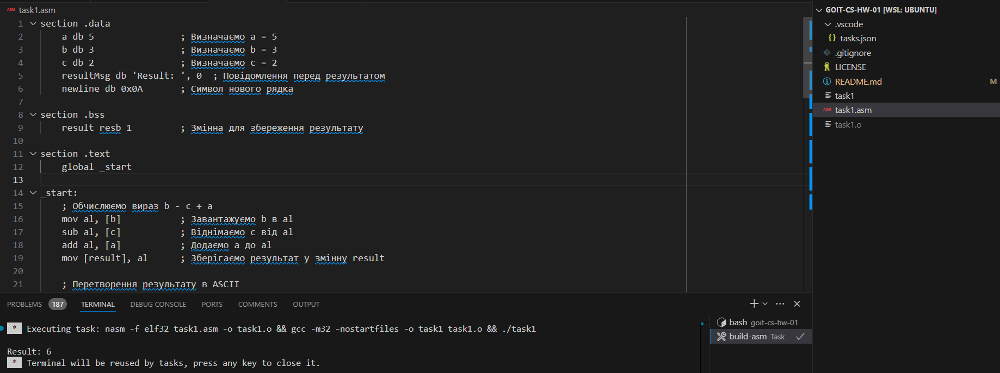

# goit-cs-hw-01
Тема 2. Вступ до компіляторів та інтерпретаторів

Перед початком роботи:
1. Версія **Python: >=3.10**
2. Cтворюємо віртуальне середовище (Python: >=3.10) `.env`: `python -m venv .env`
3. Активуємо (відповідно до своєї ОС): `source .env/bin/activate`
4. Інсталюємо залежності: `pip install -r requirements.txt`
5. По завершенню роботи деактивовуємо: `deactivate`

## Завдання 1
Розробіть програму на асемблері, яка виконує обчислення арифметичного виразу `b - c + a`.
Використовуйте як основу приклад програми для обчислення `a + b - c`, представлений у конспекті ([посилання](https://github.com/goitacademy/Computer-Systems-and-Their-Fundamentals/tree/main/Chapter%2001) на папку репозиторію до конспекту), але з необхідними модифікаціями для вирішення цього завдання.

Покрокова інструкція
1. Вивчіть код програми, що обчислює `a + b - c`, наведений у конспекті.
2. Модифікуйте програму так, щоб вона виконувала обчислення за формулою `b - c + a`.
3. Після внесення змін у код скомпілюйте та запустіть програму, щоб перевірити, чи коректно вона обчислює вираз `b - c + a`.
4. Ваша програма повинна виводити результат обчислення на екран.
5. Після запуску програми у `DOSBox` зробіть скріншот вікна `DOSBox` із відображеним результатом виконання вашої програми.

### Критерії прийняття
- Програма обчислює вираз `b - c + a` та виводить результат обчислення на екран.
- Зроблено та прикріплено скріншот вікна DOSBox із відображеним результатом виконання програми.

**Примітка**

Завдання виконано для роботи в середовищі `Linux`.
Кроки для компіляції:
1. Переконатись чи встановлено `libc6-dev-i386`, `gcc-multilib`, `g++-multilib`, `nasm`.
2. Створити файл з інструкціями `task1.asm`
3. Компіляція:
    - `nasm -f elf32 task1.asm -o task1.o`
    - `gcc -m32 -nostartfiles -o task1 task1.o`
4. Запуск: `./task1`

### Ресурси
- [task1.asm](./task1.asm)
- [task1](./task1)
- [Screenshot.png](./Screenshot.png)

## Завдання 2
У вас є початковий код інтерпретатора з конспекту, який вміє обробляти арифметичні вирази, включаючи операції додавання та віднімання (посилання на папку репозиторію до конспекту).
Ваше завдання полягає в розширенні цього інтерпретатора таким чином, щоб він також підтримував операції множення та ділення, а також коректно обробляв вирази, що містять дужки.

Покрокова інструкція
1. Розширте лексер `Lexer`
    - Додайте нові типи токенів для операцій множення `MUL`, ділення `DIV` та дужок, які відкривають `LPAREN` та закривають `RPAREN` частину арифметичного виразу.
    - Модифікуйте метод `get_next_token` класу `Lexer` так, щоб він розпізнавав ці нові символи.
2. Модифікуйте парсер `Parser`
    - Додайте метод `factor` для обробки чисел та виразів у дужках.
    - Змініть метод `term`, щоб він включав обробку множення та ділення.
    - Внесіть відповідні зміни в метод expr для підтримки нової ієрархії операцій.
3. Оновіть Інтерпретатор `Interpreter`
    - Доповніть метод `visit_BinOp` у класі `Interpreter` так, щоб він міг обробляти операції множення та ділення.
4. Тестування
    - Перевірте коректність роботи інтерпретатора на різних арифметичних виразах, включаючи вирази з дужками, наприклад `(2 + 3) * 4` повинно дати результат `20`.

### Критерії прийняття
- Додано нові типи токенів для операцій множення MUL, ділення DIV та дужок.
- Модифіковано метод get_next_token, щоб він розпізнавав нові символи.
- Модифіковано парсер Parser.
- Оновлено Інтерпретатор так, щоб він підтримував операції множення та ділення, обробляв вирази з дужками.
- Інтерпретатор працює.

### Ресурси
- [task2.py](./task2.py)

## Додатково
- [Домашнє завдання до модуля "Архітектура комп'ютерів"](https://www.edu.goit.global/uk/learn/25315460/19336208/21155308/homework)
- [https://github.com/nickolas-z/goit-cs-hw-01](https://github.com/nickolas-z/goit-cs-hw-01)
- [goit-cs-hw-01-main.zip](https://s3.eu-north-1.amazonaws.com/lms.goit.files/8121b501-a38a-45d5-9528-77145faa0e13%D0%9431_%D0%97%D1%83%D0%B1%D1%87%D0%B8%D0%BA%D0%9C%D0%B8%D0%BA%D0%BE%D0%BB%D0%B0%D0%9C%D0%B8%D0%BA%D0%BE%D0%BB%D0%B0%D0%B9%D0%BE%D0%B2%D0%B8%D1%87.zip)
- [Computer-Systems-and-Their-Fundamentals](https://github.com/nickolas-z/Computer-Systems-and-Their-Fundamentals)